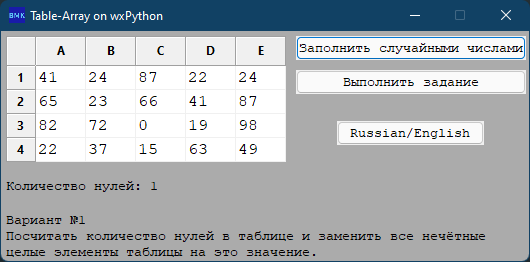
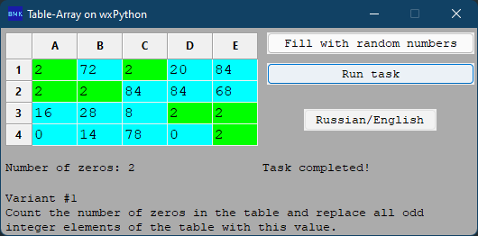
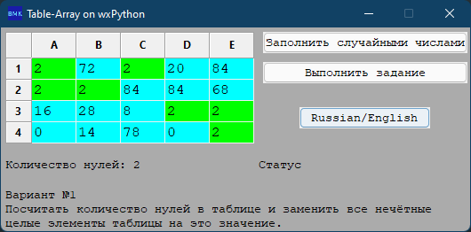
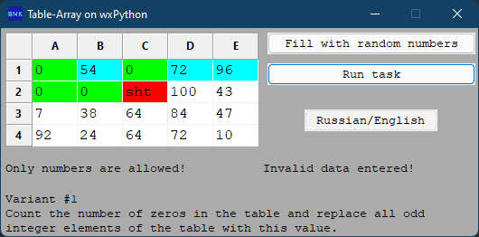
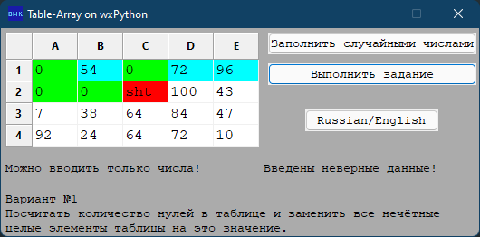

# BMK01_wxPython_Table-array

## Modern cross-platform programming

### Practical work №10. Working with table-array in wxPython

There is a 2-dimensional 4x5 array. The "Fill with random numbers" button fills the array with random values from 0 to

100. The "Run task" button processes the table according to the algorithm specified in the variant.

### Variant №1

Count the number of zeros in the table and replace all odd integer elements of the table with this value.

## Filling grid with numbers | Заполнение таблицы числами

## Executing the task | Выполнение задания

## Error | Ошибка

